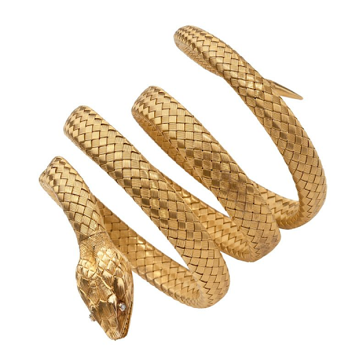

# Asclepius

|   Name   | # |                                                                                            Effects                                                                                            | LB | Value | Description                                                                                     |
| :-------: | :-: | :--------------------------------------------------------------------------------------------------------------------------------------------------------------------------------------------: | :-: | :---: | ----------------------------------------------------------------------------------------------- |
| Asclepius | 1 | Medium Spear (One-handed) (+7), Medium Spear (+7) (Dual-wielded), Thrown Medium Spear (One-handed) (+7), Large Spear (One-handed) (+7), Large Spear (+7) (Two-handed), Thrown Large Spear (One-handed) (+7), Reach Spear (One-handed) (+7), Reach Spear (+7) (Two-handed), Whip (One-handed) (+7), Whip (+7) (Dual-wielded), Metal Feeding, Command Asclepius | 3 |   ?   | This mastercrafted 5 foot golden snake was crafted by those that worshiped the Great Leviathan. |

## Effects

| Name              |                                                                                                       Description                                                                                                       | Duration |  Source  |
| :---------------- | :---------------------------------------------------------------------------------------------------------------------------------------------------------------------------------------------------------------: | :------: | :-------: |
| Metal Feeding     |                                       To repair, item can feed on metal. Different amounts result in different levels of repair and time needed to complete these repairs.                                       |          | Asclepius |
| Command Asclepius | By holding and speaking the command word "Asclepius" the user may instruct this Runecraft to perform various simple actions. "Asclepius, turn into a whip, or short spear." or Asclepius, attack those soldiers." |          | Asclepius |
