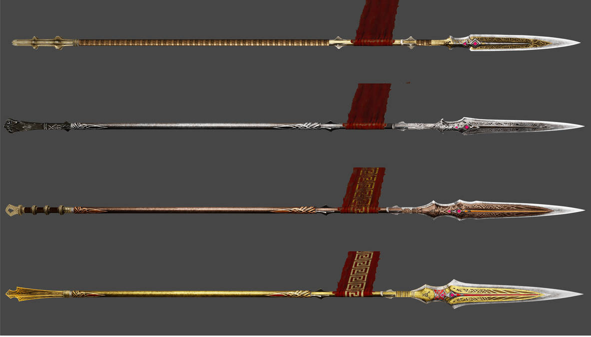

# Name

|      Name      | # |                                                                             Effects                                                                             | LB | Value | Description                                                                                                                                 |
| :------------: | :-: | :-------------------------------------------------------------------------------------------------------------------------------------------------------------: | :-: | :---: | ------------------------------------------------------------------------------------------------------------------------------------------- |
| Draupnir Spear | 1 | (One-handed) Medium Spear (+3), (Dual-wielded) Medium Spear (+3), Thrown (One-handed) Medium Spear (+3), (One-handed) Large Spear (+3), (Two-handed) Large Spear (+3), Thrown (One-handed) Large Spear (+3), Reach Spear (One-handed) (+3), Reach Spear (Two-handed) (+3), Spellcasting Focus, Draupnir | 3 | ? bc | Said to have been crafted by Siren smith long ago with the blood of a god...  This spear can be used as a Air Spellcasting Focus. |

## Effects

| Name     |                                                                                                                                                                     Description                                                                                                                                                                     |   Duration   |     Source     |
| :------- | :-------------------------------------------------------------------------------------------------------------------------------------------------------------------------------------------------------------------------------------------------------------------------------------------------------------------------------------------: | :-----------: | :------------: |
| Draupnir | This ring can transform between a weapon and ring. The ring is endowed with 10 charges. With the ring equipped, the user can force a duplication resulting in either a ring or weapon, both which appear in the users hand. Duplicates can not transform, only the original. At the break of dawn, the ring regains 1d6 + 4 expended charges. | Instantaneous | Draupnir Spear |
