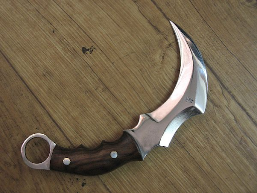

# Fang - Replica

|      Name      | # |                                             Effects                                             | LB | Value | Description                                                                                                                                           |
| :-------------: | :-: | :---------------------------------------------------------------------------------------------: | :-: | :---: | ----------------------------------------------------------------------------------------------------------------------------------------------------- |
| Talon - Replica | 1 | (One-handed) Small Pierce Melee (+1), (Dual-wielded) Small Pierce Melee (+1), (One-handed) Small Slash Melee (+1), (Dual-wielded) Small Slash Melee (+1), Thrown (One-handed) Small Pierce Melee (+1), Thrown (Dual-wielded) Small Pierce Melee (+1) | 1.5 |   ?   | Quality karambit knife taken from the Despereaux armories by Luzca Despereaux. Made to emulate the Fang karambit knife, a Despereaux family heirloom. |

## Effects

| Name | Description | Duration | Source |
| :--- | :--: | :------: | :----: |
